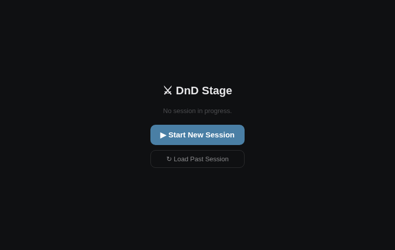
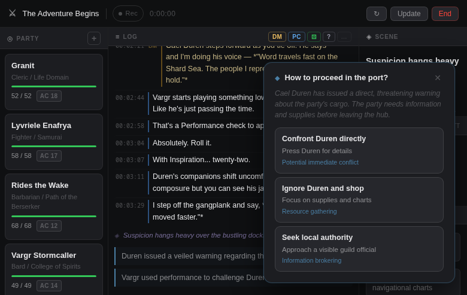
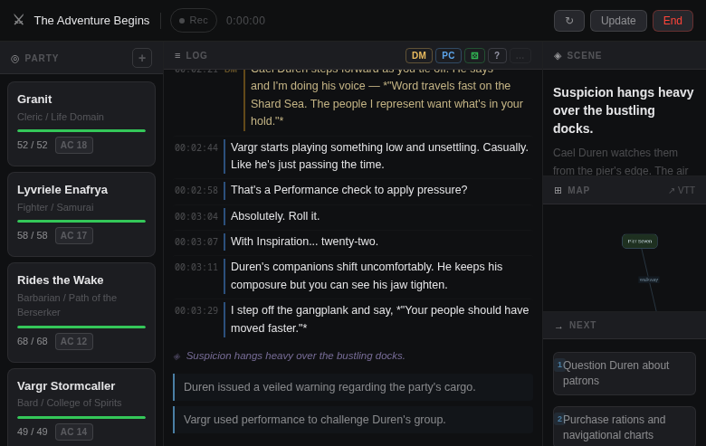
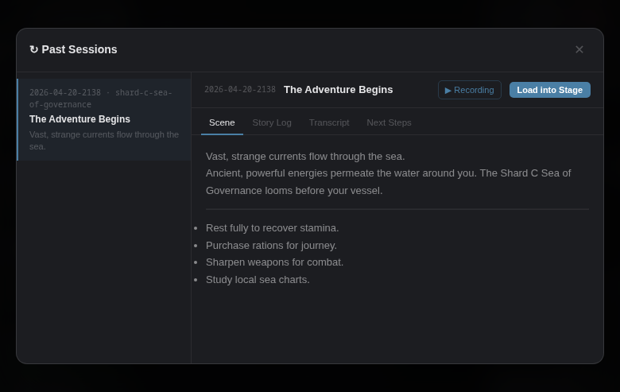

# Adventure Log — Live Session Companion

A live D&D session companion that listens to your table, tracks HP and combat state in real time, generates narrative scene panels, and publishes a living campaign journal to GitHub Pages — all powered by local LLMs.

**Campaign journal:** [doughatcher.github.io/adventure-log](https://doughatcher.github.io/adventure-log/)

---

## Campaigns

The table runs two games and alternates between them, so every session, every
character page and every AI context file is scoped to a campaign. The registry
is [`data/campaigns.yaml`](data/campaigns.yaml); its `slug` is the directory
name everywhere else.

| Slug | Campaign | DM | Status |
|------|----------|----|--------|
| `courts-of-the-shadow-fey` | Courts of the Shadow Fey | Vargr (Chris) | active |
| `shard-sea` | The Adventure Begins | Richard | paused |

```
content/sessions/<campaign>/          journal entries
content/characters/<campaign>/        character pages
context/campaigns/<campaign>/         campaign-history.md, next-session-brief.md
data/characters/<campaign>/           live HP/AC sheets the tracker reads
data/sessions/<archive>/state.json    "campaign": "<slug>"  ← the source of truth
```

**Where the campaign comes from.** A session archive declares its own campaign in
`state.json`. The live server stamps it from `CAMPAIGN` in `.env`; an import from
Transcripts stamps it from `--campaign`. The journal generator reads it and
**refuses to run** if an archive does not say — guessing is how a barbarian from
the Shard Sea campaign twice acquired a death scene during a session of Courts of
the Shadow Fey. Adding a campaign means adding a row to `data/campaigns.yaml` and
creating its two `context/campaigns/<slug>/` files.

**Switching games:** set `CAMPAIGN=` in `.env` before starting the live app, and
start the matching session profile in Transcripts (see below). Both are
one-time-per-night actions and both are checkable — the tracker shows the wrong
party immediately if you forget.

---

## Screenshots

**Start screen** — shown when no session is in progress. Click to begin or load a past session.



**Live session** — party tracker, color-coded transcript log (DM / PC / Roll / OOC), AI-updated scene and next-steps panels, and map graph. The decision helper pops up automatically when the AI detects an active fork in play.





**Past sessions** — browse archived sessions, view scene/story/transcript tabs, download the MP3 recording, or load the session into the main stage for review.



---

## What It Does

| Feature | How |
|---------|-----|
| **Voice → Transcript** | Microphone audio → local Speaches/Whisper → live transcript log |
| **Fast AI pass (~4s)** | Extracts HP, enemies, conditions from transcript |
| **Full AI pass (~20s)** | Updates Scene, Story, Map, and Next Steps panels |
| **Party tracker** | Fuzzy HP tracking; enemies appear when mentioned; long rest restores |
| **Decision modal** | Pops up when AI detects an active choice (shop, fork, tactic) |
| **Session archive** | End Session: audio → MP3, all panels → markdown archive |
| **Campaign journal** | GitHub Action auto-generates narrative HTML and deploys to Pages |
| **D&D Beyond polling** | Live character HP/conditions synced from DDB character API (see below) |

---

## Architecture

```
Microphone → Speaches STT → transcript.md
                               ↓
                     dnd-stage server (FastAPI)
                               ↓
                    Ollama (local LLM, e.g. gemma4)
                     ├── fast pass: state.json     (HP, conditions)
                     └── full pass: panels/*.md    (scene, story, map)
                               ↓
                    Session archive (data/sessions/YYYY-MM-DD-HHMM/)
                               ↓
              GitHub Action (generate_journal.py → Claude API)
                     │  reads "campaign" from the archive's state.json
                     ├── content/sessions/<campaign>/*.md    (narrative journal post)
                     ├── content/characters/<campaign>/*.md  (character pages)
                     └── context/campaigns/<campaign>/next-session-brief.md
                               ↓
                    Hugo → GitHub Pages (adventure-log)

Optional: D&D Beyond → ddb_poll.py → PATCH /api/characters/{slug}
```

---

## Requirements

| Service | Purpose | Default |
|---------|---------|---------|
| [Ollama](https://ollama.ai) | Local LLM for state/panel generation | `localhost:11434` |
| [Speaches](https://github.com/speaches-ai/speaches) | Whisper STT for voice transcription | `localhost:8000` |
| `ffmpeg` | Audio chunk concat → MP3 | system PATH |

**Recommended model:** `gemma4:e4b` — 12GB VRAM, ~50 t/s on RTX 4070.

```bash
ollama pull gemma4:e4b
```

---

## Quickstart

```bash
# 1. Clone
git clone https://github.com/doughatcher/adventure-log
cd adventure-log

# 2. Configure
cp .env.example .env
# Edit .env — set OLLAMA_MODEL, optionally GITHUB_TOKEN for releases

# 3. Run (requires uv)
uv run uvicorn server.main:app --host 0.0.0.0 --port 3200 --reload

# 4. Open http://localhost:3200
```

---

## Docker

```bash
docker build -t dnd-stage .
docker run -p 3200:3200 \
  -e OLLAMA_BASE=http://host.docker.internal:11434 \
  -e SPEACHES_BASE=http://host.docker.internal:8000 \
  -v $(pwd)/session:/app/session \
  -v $(pwd)/data:/app/data \
  dnd-stage
```

---

## D&D Beyond Integration

Live HP and condition sync from D&D Beyond's character API into the party tracker.

### Setup (one-time, requires desktop session with display)

```bash
# Step 1: Open browser, log in to DDB, capture CobaltSession cookie
python scripts/ddb_auth.py
# → Writes DDB_COOKIE to .env

# Step 2: Discover campaign character IDs
python scripts/ddb_discover.py
# → Writes DDB_CHARACTER_IDS to .env

# Step 3: Start polling loop
python scripts/ddb_poll.py
# → Polls DDB every 60s, PATCHes http://localhost:3200/api/characters/{slug}
```

### How It Works

1. `ddb_auth.py` — opens a Playwright browser (non-headless) for manual login to D&D Beyond, extracts the `CobaltSession` HttpOnly cookie using CDP, writes to `.env`
2. `ddb_discover.py` — exchanges the cookie for a cobalt API token, calls `api.dndbeyond.com/campaign/stt/active-short-characters/{campaign_id}`, writes character IDs to `.env`
3. `ddb_poll.py` — polls each character's stat endpoint on `DDB_POLL_INTERVAL` (default 60s), maps slugs to DDB character IDs, PATCHes the dnd-stage server with current HP and conditions

### Notes

- **Requires GNOME/desktop session:** DDB login uses PerimeterX bot detection that blocks headless Chromium. Run `ddb_auth.py` from a terminal with a display.
- **HttpOnly cookie:** `CobaltSession` is not readable via `document.cookie`. The scripts use Playwright CDP (`context.cookies()`) which can access HttpOnly cookies after an authenticated session.
- **Token refresh:** `ddb_poll.py` refreshes the cobalt token each poll cycle — tokens expire (~1800s TTL).
- **Slug mapping:** Character slugs (e.g. `rides-the-wake`) must match filenames in `data/characters/<campaign>/` for the campaign named by `CAMPAIGN`. Edit `DDB_CHARACTER_IDS` in `.env` to set `slug=ddb_id` pairs.

---

## Recording with Transcripts

[Transcripts](https://transcripts.hatcher.ltd) groups an evening's recordings
into one *session* and runs a completion hook once when the night is over. A
session profile is per-*kind*-of-occasion, and there is no rule that says there
can only be one — so **the campaign picker is just two session profiles**. Which
one you start from the menu bar (or the *Start Session* Shortcuts action) is
which game you are recording, and `${sessionID}` carries that through to the
import.

In `routing.json`:

```json
"sessions": [
  {
    "id": "courts-of-the-shadow-fey",
    "name": "D&D — Courts of the Shadow Fey",
    "destination": "Campaigns/CotSF/transcripts/",
    "idleTimeout": 5400,
    "hardStop": "01:30",
    "onComplete": {
      "executable": "/bin/bash",
      "arguments": ["-c", "~/repos/adventure-log/scripts/import_transcripts_session.py --campaign \"$CAMPAIGN\" --slug \"$SLUG\" --started-at \"$STARTED\" --ended-at \"$ENDED\" --transcripts \"$TRANSCRIPTS\""],
      "environment": {
        "CAMPAIGN": "${sessionID}",
        "SLUG": "${slug}",
        "STARTED": "${startedAt}",
        "ENDED": "${endedAt}",
        "TRANSCRIPTS": "${transcripts}"
      }
    }
  },
  {
    "id": "shard-sea",
    "name": "D&D — The Adventure Begins",
    "destination": "Campaigns/ShardSea/transcripts/",
    "idleTimeout": 5400,
    "hardStop": "01:30",
    "onComplete": { "...": "same, the id supplies the campaign" }
  }
]
```

Give each profile the **same `id` as the campaign slug** in
`data/campaigns.yaml` and nothing else has to be kept in sync. The import
validates the slug against that file and refuses an unknown one, so a typo in
`routing.json` fails loudly on the night rather than filing the session under
the wrong party.

The importer opens a pull request rather than pushing to `main` — this
repository is public and a raw table transcript should be read by a person
before it ships. Merging the PR is what triggers the journal workflow.

---

## Campaign Journal (GitHub Pages)

After each session, push the archived `data/sessions/YYYY-MM-DD-HHMM/` folder to main. A GitHub Action fires:

1. **Generates narrative** — calls Claude API to write journal prose, character updates, and a dense next-session AI brief from the session transcript and panels
2. **Commits content** — writes `content/sessions/` and `content/characters/` markdown
3. **Deploys Hugo** — builds the static site and pushes to GitHub Pages

The journal accumulates session by session. Each entry builds on the last — characters develop, the story deepens, context grows. `context/campaign-history.md` and `context/next-session-brief.md` are fed to Claude on each generation run so the narrative always has full backstory.

**Required secrets:** `ANTHROPIC_API_KEY` in repo Settings → Secrets → Actions.

---

## Character PATCH API

Party HP and conditions can be partially updated without overwriting other fields:

```bash
# HP only — preserves class, AC, notes, conditions
curl -X PATCH http://localhost:3200/api/characters/granit \
  -H "Content-Type: application/json" \
  -d '{"hp_current": 30}'

# Conditions only
curl -X PATCH http://localhost:3200/api/characters/rides-the-wake \
  -H "Content-Type: application/json" \
  -d '{"conditions": ["Poisoned", "Frightened"]}'
```

---

## Configuration

All settings via `.env`:

| Variable | Default | Description |
|----------|---------|-------------|
| `CAMPAIGN` | `courts-of-the-shadow-fey` | Which game is at the table. Scopes the roster, the AI brief, and the campaign stamped into the session archive. |
| `OLLAMA_BASE` | `http://localhost:11434` | Ollama API endpoint |
| `OLLAMA_MODEL` | `gemma4:e4b` | Model for all generation |
| `SPEACHES_BASE` | `http://localhost:8000` | Speaches STT endpoint |
| `PORT` | `3200` | HTTP/WS port |
| `GITHUB_REPO` | — | `owner/repo` for release publishing |
| `GITHUB_TOKEN` | — | Token with repo write scope |
| `DDB_CAMPAIGN_ID` | — | D&D Beyond campaign ID |
| `DDB_COOKIE` | — | CobaltSession cookie (set by ddb_auth.py) |
| `DDB_CHARACTER_IDS` | — | `slug=id,slug=id` pairs (set by ddb_discover.py) |
| `DDB_POLL_INTERVAL` | `60` | DDB poll interval in seconds |
| `STATE_TRIGGER_CHARS` | `80` | Transcript chars before fast state update |
| `STATE_DEBOUNCE_SECS` | `6` | Fast state update debounce |
| `PANEL_TRIGGER_CHARS` | `300` | Transcript chars before full panel update |
| `PANEL_DEBOUNCE_SECS` | `12` | Full panel update debounce |

---

## Project Layout

```
dnd-stage/
├── client/              # Frontend (vanilla JS, no build step)
├── server/              # FastAPI backend
│   ├── main.py          # Routes, WebSocket, PATCH endpoint
│   ├── gemma.py         # LLM prompting, panel/state updates
│   ├── stt.py           # Speaches STT integration
│   └── config.py        # Env vars + DDB config
├── scripts/             # D&D Beyond integration
│   ├── ddb_auth.py      # Browser login → CobaltSession cookie
│   ├── ddb_discover.py  # Campaign character ID discovery
│   └── ddb_poll.py      # Live HP/conditions polling loop
├── data/
│   ├── campaigns.yaml   # Campaign registry — slugs, DMs, status
│   ├── characters/      # <campaign>/*.md — stats frontmatter
│   └── sessions/        # Archived sessions (push to trigger journal)
├── session/             # Live session state (gitignored)
├── content/             # Hugo site content (auto-generated)
│   ├── characters/      # <campaign>/*.md — character narrative pages
│   └── sessions/        # <campaign>/*.md — session journal entries
├── context/
│   └── campaigns/<slug>/
│       ├── campaign-history.md    # World lore, party, session log
│       └── next-session-brief.md  # Dense AI brief, updated each session
├── layouts/             # Custom Hugo templates
├── .github/
│   ├── workflows/campaign-journal.yml   # Pages deploy pipeline
│   └── scripts/generate_journal.py      # Claude journal generator
├── hugo.toml
└── .env.example
```
